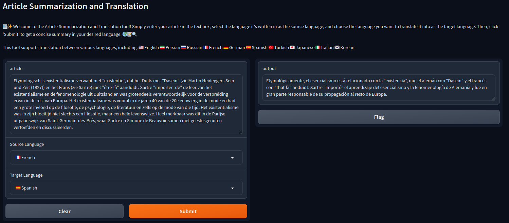

# Article Summarization and Translation Tool

Welcome to the Article Summarization and Translation tool! This tool utilizes advanced natural language processing models to summarize and translate articles from one language to another. Simply input your article, select the source and target languages, and let the tool generate a concise summary in your desired language.

## Supported Languages

This tool supports translation between various languages, including:

- 🇺🇸 English
- 🇮🇷 Persian
- 🇷🇺 Russian
- 🇫🇷 French
- 🇩🇪 German
- 🇪🇸 Spanish
- 🇹🇷 Turkish
- 🇯🇵 Japanese
- 🇮🇹 Italian
- 🇰🇷 Korean

## Interface View

*Screenshot of the interface showing the image upload and language selection*

## Usage

1. **Input Article**: Enter your article in the provided text box.
2. **Source Language**: Select the language of the article from the dropdown labeled "Source Language".
3. **Target Language**: Choose the language you want to translate the article into from the dropdown labeled "Target Language".
4. **Summarize & Translate**: Click on the 'Submit' button to initiate the process.
5. **View Results**: The tool will generate a summarized and translated version of the article in the chosen target language.

## Examples

### Example 1:
- **Source Language:** 🇮🇷 Persian
- **Target Language:** 🇮🇹 Italian

### Example 2:
- **Source Language:** 🇫🇷 French
- **Target Language:** 🇪🇸 Spanish

## Description

This tool leverages state-of-the-art language models, including MBart for translation and BART for summarization. It seamlessly integrates these models to provide efficient and accurate summarization and translation services. The interface is user-friendly and intuitive, allowing users to quickly summarize and translate articles with just a few clicks.

## Dependencies

To run this code, you need to install the following dependencies:

- **gradio**: Gradio is a Python library that allows you to create interfaces for your machine learning models. It provides a simple interface for building web-based UIs.
  
  You can install gradio via pip:

```
pip install gradio
```

- **transformers**: Transformers is a popular Python library by Hugging Face that provides state-of-the-art natural language processing models, including BART and MBart.

You can install transformers via pip:

```
pip install transformers
```

Ensure you have Python installed on your system, and consider using a virtual environment to manage your dependencies cleanly. Additionally, make sure you have an internet connection during installation, as some dependencies might require downloading pre-trained models.

## Note

Please note that the summarization and translation quality may vary depending on the complexity of the input article and the selected languages. Additionally, as this tool utilizes pre-trained models, the performance may be influenced by the data used during training.
